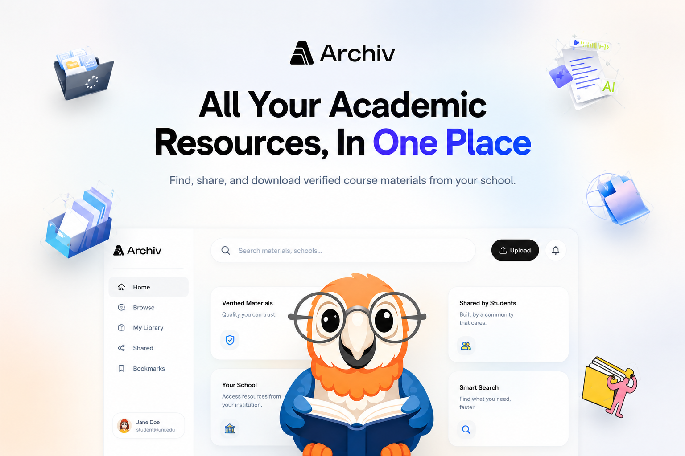

# Archiv

> **Academic materials, structured properly.**



Archiv is a modern academic resource platform built to help students **discover, organize, share, and access academic materials** based on their school, department, level, and semester.

It is designed around one simple idea:

**Finding academic materials should be organized, fast, and accessible.**

---

## ✨ Features

### 🎓 Academic Organization

Archiv organizes resources around the way students actually study:

- Schools
- Departments
- Levels
- Semesters
- Course materials
- Lecture notes
- Past questions
- Other academic resources

Instead of searching through scattered WhatsApp groups, Telegram channels, Google Drive links, or random files, students can find materials in a structured academic environment.

### 📚 Materials

Students can:

- Browse academic materials
- Preview supported documents
- Download materials
- Save materials for later
- View material information
- Discover related academic resources
- Share material links

### 🔎 Search & Discovery

Archiv provides search and browsing functionality to help students quickly find:

- Schools
- Departments
- Academic materials
- Resources relevant to their academic journey

### 📤 Contributions

Students can contribute to the academic archive by uploading useful materials.

Contributors can:

- Upload academic documents
- Add descriptions
- Associate materials with schools and departments
- Organize resources by level and semester
- Manage their uploaded materials

### 🔗 Sharing

Archiv is designed to make academic resources easy to share.

Students can share:

- Materials
- Schools
- Departments
- Other public Archiv pages

Every public resource has a shareable URL that can be copied or shared through supported device sharing functionality.

### 🔐 Authentication

Archiv includes a complete authentication system with:

- User registration
- Login
- Email verification
- Password reset
- Protected routes
- User profiles
- Role-based permissions

### 👤 User Profiles

Users can:

- Manage their profile
- View their uploaded materials
- View saved materials
- Update account settings
- Change their password
- Delete their account

### 🛡️ Role-Based Access

Archiv currently supports multiple user roles:

- `user`
- `contributor`
- `admin`

Different roles have access to different capabilities across the platform.

---

## 🖥️ Design

Archiv follows a clean, spacious, academic interface.

The design philosophy is:

> **Clean. Spacious. Academic. Premium. Minimal.**

The interface is responsive and designed to work across:

- 📱 Mobile
- 💻 Desktop
- 🖥️ Larger displays

Desktop users get a dedicated application shell with sidebar navigation, while mobile users get a compact navigation experience.

---

## 🛠️ Tech Stack

### Frontend

- [Next.js](https://nextjs.org/)
- React
- TypeScript
- Tailwind CSS
- TanStack Query
- React Hook Form
- Zod
- Axios
- Framer Motion
- Lucide Icons

### Backend

- Node.js
- Express.js
- TypeScript
- MongoDB
- Mongoose
- JWT
- HTTP-only cookies
- Multer
- Cloudinary
- Nodemailer

### Infrastructure & Services

- MongoDB Atlas
- Cloudinary
- SendGrid
- Vercel
- Render

---

## 🏗️ Architecture

Archiv is structured as a full-stack application.

```text
Archiv
│
├── Client
│   ├── Next.js
│   ├── React
│   ├── TypeScript
│   ├── Tailwind CSS
│   └── TanStack Query
│
└── Server
    ├── Node.js
    ├── Express
    ├── Docker
    ├── MongoDB
    ├── Mongoose
    ├── LibreOffice
    ├── JWT Authentication
    └── Cloudinary
```

---

## 🤝 Contributing

Archiv welcomes contributors and contributions.

Whether you're interested in improving the frontend, backend, documentation, developer experience, or adding new features, you can help make Archiv better for students.

### Ways to contribute

You can contribute by:

- 🐛 Reporting bugs
- 💡 Suggesting new features
- 🎨 Improving the UI/UX
- ⚡ Improving performance
- 🔐 Improving security
- 📚 Improving documentation
- 🧪 Adding tests
- 🧹 Refactoring and improving existing code
- 🔧 Fixing issues
- 🚀 Building new features
